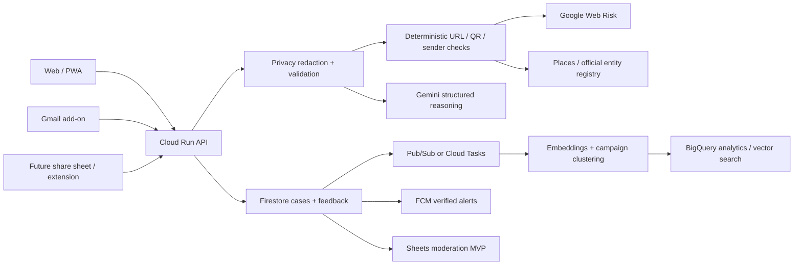

# ScamSignal AI — product vision and scale roadmap

## North-star concept

ScamSignal should evolve from a one-shot risk scorer into a Vietnamese-first **decision safety layer**:

> Detect → independently verify → guide the safest next action → help the community recognize the next mutation.

The memorable product idea is **"Trust Twin"**: when a message claims to be from a bank, government agency, delivery company, employer, or merchant, ScamSignal builds an independent profile of the legitimate entity and places it next to the observed evidence. The user sees exactly what matches, what conflicts, and what is still unknown.

This positioning avoids competing only on a numeric trust score. Existing products already cover broad site scoring, checking/reporting, and call/SMS filtering. ScamSignal's differentiation should be contextual Vietnamese reasoning, independent-channel resolution, multimodal evidence, and an actionable recovery journey.

## Four product pillars

### 1. Check — multimodal evidence, not a black-box verdict

- Accept message text, URL, screenshot, QR image, email, phone number, bank-account claim, and marketplace listing.
- Redact OTPs, passwords, card-like numbers, and unnecessary personal data before cloud processing.
- Combine deterministic URL/QR checks, Google Web Risk, Gemini multimodal analysis, and community-campaign similarity.
- Keep four result states: `high risk`, `suspicious`, `no strong signal`, and `insufficient evidence`.
- Keep the AI score as a secondary estimate, paired with a confidence range and source timestamp. Never present it as proof.

### 2. Verify — Trust Twin independent-channel resolver

- Extract the claimed organization, domain, phone, address, payment recipient, and communication channel.
- Compare the observed domain against a curated official-domain registry and Google Places details.
- Show the official website, phone number, Maps location, and safe contact route from an independent source.
- Never open or call the suspicious source directly.
- Surface contradictions as a compact evidence graph: `claim → observed identity → official identity → mismatch`.

### 3. Act — a time-sensitive safety and recovery flow

Add a persistent second entry point: **"Tôi đã chuyển tiền / cung cấp thông tin"**.

- Ask only the minimum triage questions: money sent, credential/OTP exposed, card exposed, account access lost.
- Generate a prioritized checklist for the first 10 minutes, 1 hour, and 24 hours.
- Offer safe links to the bank's official channel and nearby official assistance locations.
- Create a redacted evidence package for the user to download or save to Drive.
- Optionally create Calendar reminders for follow-up actions such as checking account activity or following up with the bank.
- Never claim to file an official police report unless an actual verified reporting integration exists.

### 4. Learn — community immunity without public accusation

- Let users submit a redacted report and receive a case status.
- Cluster similar message templates, visual layouts, domains, and phone-number patterns into campaigns.
- Require moderation and evidence thresholds before marking an entity as verified malicious.
- Notify opted-in users about a newly verified campaign through Firebase Cloud Messaging.
- After every analysis, show a 20–30 second micro-lesson that highlights the exact persuasion tactic or altered character. The goal is to improve future judgment, not only stop one click.

## Google ecosystem integrations

| Integration | User value | Contest-sized MVP | Scale path |
|---|---|---|---|
| Gemini | Structured multimodal reasoning and Vietnamese explanation | Text + screenshot + QR reasoning with strict schema | Model routing, evaluation set, safety/version monitoring |
| Web Risk | Independent malicious-URL evidence | Server-side lookup with explicit `not listed` semantics | Cached checks, batch/enterprise feeds if traffic justifies it |
| Gmail Workspace add-on | Analyze the email currently open without copy/paste | Contextual add-on card with `Check with ScamSignal` | Admin-installed Workspace product for schools/SMEs |
| Google Places / Maps | Resolve an organization's independent phone, website, and physical branch | Verify one claimed entity and show the official Maps link | Entity resolution service and nearby assistance routing |
| Firebase Auth + Firestore | Anonymous case feedback and moderated reports | Anonymous user ID, helpful/not-helpful, redacted report record | Multi-tenant organizations, real-time campaign status |
| Firebase App Check | Reduce scripted abuse of public endpoints | Protect Firebase and analysis endpoints | Enterprise attestation and abuse tuning |
| Firebase Cloud Messaging | Timely verified campaign alerts | Opt-in web alert for one category | Personalized region/category subscriptions |
| Google Sheets | Fast moderation and evaluation operations | Append redacted cases to a private reviewer sheet | Replace with a purpose-built console when volume grows |
| Google Drive / Docs | Portable incident evidence | Export a redacted report with timestamps and source labels | Signed evidence packages and organization workflows |
| Google Calendar | Recovery follow-up, not core detection | Add user-approved reminders from Rescue Mode | Organization incident workflows |
| BigQuery + vector search | Discover mutations of known scam campaigns | Keep as a documented architecture demo or small batch experiment | Campaign clustering, analytics, model evaluation at scale |

Do not add an integration only for logo count. Gmail, Firebase, Places, and Drive directly strengthen the main journey. Calendar and Sheets should remain supporting tools.

## Professional UI/UX direction

### Visual language

Use a **public-interest fintech** aesthetic: trustworthy like a government service, precise like a fraud-operations console, and calm enough for a person under pressure.

- Base: warm white, navy ink, slate borders.
- Positive verification: teal, used sparingly.
- Warning: amber; danger: vermilion red.
- Avoid bank-brand imitation, glowing gradients, glassmorphism, and decorative "AI" effects.
- Use a readable Vietnamese UI typeface at 16 px body size; monospace only for domains, IDs, and timestamps.
- Default content width around 1180–1280 px with generous whitespace.
- Minimum 44 px touch targets and visible `:focus-visible` states.

### Information architecture

1. **Home / Triage**
   - "Kiểm tra nội dung đáng ngờ"
   - "Xác minh tổ chức / số điện thoại / tài khoản"
   - "Tôi đã chuyển tiền"
2. **Capture**
   - Text/link, screenshot/QR, or Gmail add-on entry.
   - A short privacy preview shows what will be removed before submission.
3. **Result**
   - One-sentence verdict and one primary action above the fold.
   - Trust Twin comparison.
   - Verified evidence, AI inference, and unknowns in separate sections.
   - Technical pipeline details collapsed under "Cách kết quả được tạo".
4. **Recovery**
   - Prioritized timeline, official contact routes, evidence export, optional reminders.
5. **Learn / Report**
   - One micro-lesson, feedback, and consent-based redacted report.

### Result hierarchy

The first mobile viewport should answer only four questions:

1. Should I stop?
2. What exact clue caused this warning?
3. Which official channel should I use instead?
4. What do I do next?

The current 0–100 score can remain, but it should not dominate the screen. Use a status banner as the primary signal and label the score `Ước tính của AI`, with confidence and last-checked time.

## Scalable architecture

### Scale controls

- Run stateless analysis endpoints on Cloud Run with capped instances, request limits, timeouts, and rate limits.
- Cache URL and entity lookups by normalized identifier and evidence timestamp.
- Move embeddings, OCR enrichment, report clustering, and alert fan-out to asynchronous jobs.
- Store redacted structured facts by default; raw screenshots/messages require explicit consent and short TTL deletion.
- Use Firestore for operational cases and real-time status, then export aggregate/anonymized data to BigQuery.
- Use Firebase App Check, security rules, anonymous/authenticated identity boundaries, and human moderation.
- Monitor latency, provider errors, false positives, cost per analysis, and reports per campaign.
- Never expose user-submitted allegations publicly without corroboration and review.

## Competition scope: build the strongest vertical slice

### P0 — must ship before re-recording the demo

1. Redesign the home and result journey with readable typography and mobile-first hierarchy.
2. Add three entry routes: Check, Verify, and Rescue.
3. Implement a Trust Twin demo for bank impersonation: altered domain + claimed organization + official channel.
4. Add screenshot/QR annotations that point to the exact suspicious element.
5. Add one-tap redacted feedback/report flow backed by Firestore and App Check.
6. Expand evaluation to at least 50 Vietnamese cases, including genuine messages and ambiguous cases.
7. Show measurable outcomes: accuracy by scenario, false-positive rate, median latency, and user helpfulness.

### P1 — high-impact competition differentiators

1. Gmail Workspace add-on prototype.
2. Drive evidence export and Rescue Mode timeline.
3. Private Google Sheets moderation dashboard.
4. Small campaign-similarity experiment using embeddings.

### P2 — post-competition scale

1. FCM campaign alerts and family/guardian sharing.
2. Google Chat app and organization policy controls.
3. BigQuery vector search and campaign intelligence.
4. Partnerships with banks, schools, marketplaces, and anti-scam authorities.

## Success metrics

- `Decision safety`: percentage of high-risk test users who choose a safe next action.
- `Comprehension`: percentage who can name the exact suspicious clue after the result.
- `Model quality`: recall, precision, false-positive rate, and calibration by scam type.
- `Coverage`: URL, message, screenshot, QR, email, and recovery scenarios.
- `Operations`: median/P95 latency, API error rate, cost per completed analysis.
- `Community`: useful reports, moderation turnaround, and newly detected campaign mutations.
- `Privacy`: percentage of submissions successfully redacted and raw-data deletion compliance.

## Research basis

- Singapore's ScamShield shows that check, report, block/filter, alerts, and human support work best as a suite rather than a single scanner: https://www.tech.gov.sg/products-and-services/for-citizens/scam-prevention/scamshield/
- ScamAdviser already uses more than 40 data sources for dynamic website trust scoring, so score-only positioning is not distinctive: https://www.scamadviser.com/about-scamadviser
- Explainable phishing warnings improve comprehension and later identification accuracy compared with generic warnings: https://arxiv.org/abs/2505.06836
- Game-based scam inoculation showed durable gains in scam discernment in a randomized study: https://arxiv.org/abs/2503.12341
- Gmail contextual add-ons can react to the currently opened message: https://developers.google.com/workspace/add-ons/gmail/extending-message-ui
- Firestore supports real-time systems at large scale, while App Check helps restrict backend access to legitimate app instances: https://firebase.google.com/docs/firestore/real-time_queries_at_scale and https://firebase.google.com/docs/app-check/web/recaptcha-provider
