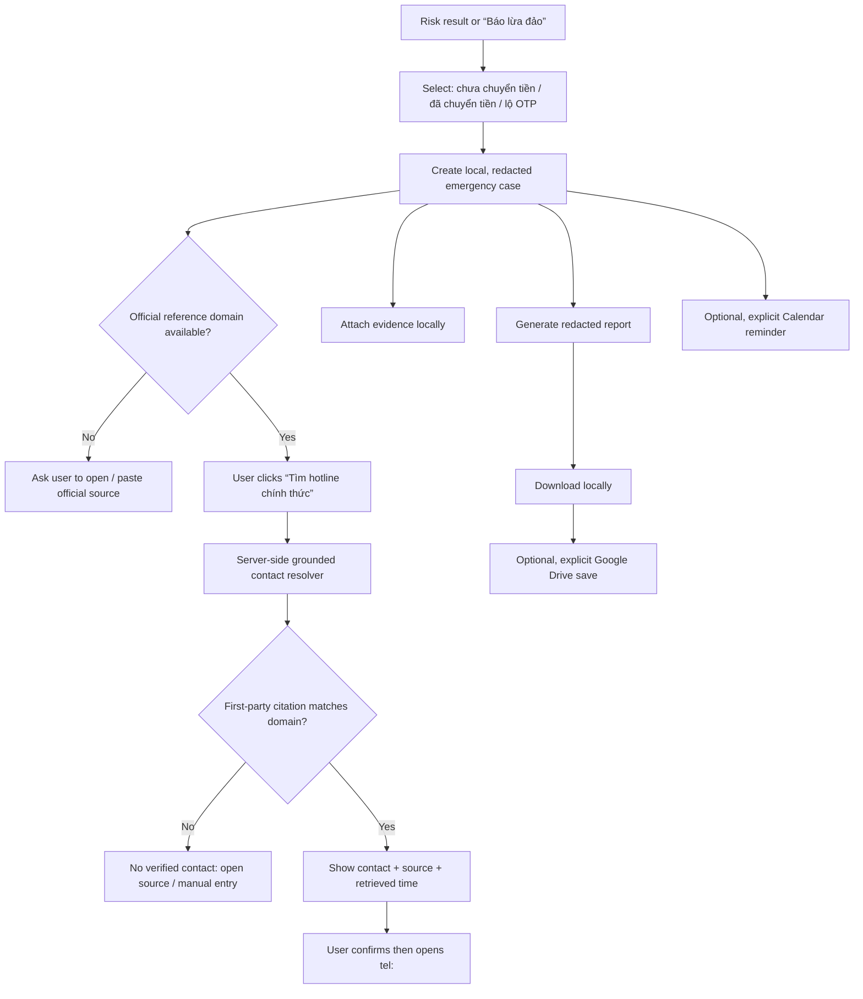

# Rescue Mode — implementation plan

> Deep-dive plan. The cross-product implementation order and release schedule
> are maintained in `SCAMSIGNAL_REAL_PRODUCT_IMPLEMENTATION_PLAN.md`; the
> current feature status is maintained in `FEATURE_TRUTH_MATRIX.md`.

## Decision and scope

Rescue Mode should become a **decision-support flow**, not a page that visually implies bank, Google Workspace, or emergency-service integrations that do not exist. The priority is to make the first 15 minutes after a suspected scam actionable without inventing a contact, initiating a call, or transmitting sensitive material without consent.

This plan replaces the current visual-only portions of the rescue screen. It remains compatible with the public Google AI Studio release candidate and does not require Cloud Run billing for the P0 local-only milestone.

## P0 implementation status

| Element | Current behavior after local P0 | Status | Next increment |
| --- | --- | --- | --- |
| Timeline completion | Starts pending and persists user-confirmed timestamps in IndexedDB. | Local P0 pass | Add deterministic scenario-specific action policy. |
| Official contact | Opens a safe-channel guide and explicitly withholds any ungrounded hotline. | Honest fallback | Resolve a first-party citation, then confirm before `tel:`. |
| Guide / evidence / report | Native guide dialogs, real local blobs, inventory, preview and JSON/TXT download. | Local P0 pass | Add source citations to scenario-specific guidance. |
| Case time, amount, files | Populated from a versioned case; empty states and counts are real. | Local P0 pass | Add optional redacted incident notes. |
| Drive / Calendar | Branded rows render `Chưa kết nối`; no switches imply OAuth success. | Planned honestly | Enable only with OAuth and returned file/event receipts. |
| Privacy | Dialog states storage/transmission truth and confirmed delete clears case + evidence. | Local P0 pass | Add retention settings if cloud sync ships. |

The local P0 implementation lives in `src/features/rescue/RescueView.tsx`,
`src/features/rescue/local-case-store.ts`, and
`packages/core/src/rescue-case.ts`. Public AI Studio still needs to be synced and
retested before these capabilities can be claimed in the submission.

## Product rule: not an AI “crawler”

The proposed hotline feature is valuable, but it must not let a generative model guess a phone number or treat a search-result snippet as official. In a scam product, a wrong hotline can cause another loss.

Build a **grounded contact resolver** with these rules:

1. Resolve only after the user supplies or Trust Twin establishes an official reference domain. A brand name from the scam message alone is insufficient.
2. Send only the organization name, official domain, locale, and requested contact type to the resolver — never the raw scam message, OTP, account number, or screenshot.
3. Use Gemini Grounding with Google Search and optionally URL Context only to find a first-party page. Gemini returns citations; render them beside every suggested contact. Google documents that Search grounding is built to return cited, real-time sources, but it can incur a billed search query, so the feature needs a feature flag, cache, rate limit, and explicit user initiation. [Google Search grounding](https://ai.google.dev/gemini-api/docs/google-search)
4. A number becomes **Verified contact** only when its citation host equals the accepted official domain (or an allowlisted official support subdomain). Otherwise show `Không đủ nguồn chính thức` and offer `Mở trang nguồn tham chiếu` or `Nhập nguồn thủ công`.
5. Never place a call automatically. The user sees the number, source URL, retrieval time, and a confirmation dialog before the browser opens `tel:`.
6. Return `Không tìm thấy` rather than filling gaps with model output. Cache public contact metadata only; do not persist the user’s scam content.
7. The fictional NovaBank demo must use a local fixture labelled `Dữ liệu minh họa`, never a live web lookup.

## Target rescue journey



## UX and visual specification

### 1. Replace the timeline with honest action states

Each step gets a status, a next action, and a receipt:

| Step | Before action | After success | User-visible proof |
| --- | --- | --- | --- |
| Bank | `Tìm hotline chính thức` | `Gọi 1900 …` | Source domain, source title, time retrieved, `Đổi nguồn`. |
| Account | `Xem hướng dẫn an toàn` | `Đã xem hướng dẫn` | Accordion/side sheet with bank-independent safe steps and official-source link. |
| Evidence | `Thêm bằng chứng` | `3 tệp đã thêm` | Actual file names, sizes, redaction warning, remove action. |
| Report | `Tạo hồ sơ` | `Hồ sơ sẵn sàng` | Report preview with `Tải xuống`, `Lưu lên Drive` when connected. |

- Timeline time labels are prioritization markers, not a fake running clock. The actual case time uses `Intl.DateTimeFormat('vi-VN', …)`.
- Completion is explicit: user marks a step as done after doing it. Never infer that a bank call, password change, or police report was completed.
- Async buttons show `Đang tìm nguồn…`, success, retryable error, or `Chưa đủ nguồn`; status regions use `aria-live="polite"`.
- The `privacy` action opens a bottom sheet/modal with “lưu trên thiết bị”, “gửi sang Google Drive”, and “xóa hồ sơ trên thiết bị”. No data leaves the device before the relevant action and consent.

### 2. Make Google Workspace recognizable without impersonating a connection

Use the current official Google Drive and Google Calendar product marks as local, labelled assets, following Google’s product/icon guidance. They clarify the *destination* of a connected action; they must not be used as decoration that implies a partnership or active integration. [Google Brand Resource Center](https://about.google/brand-resource-center/products-and-services/)

Replace the two checked toggles with these explicit rows:

| State | Drive row | Calendar row |
| --- | --- | --- |
| Not configured | Drive logo + `Chưa kết nối` + disabled `Kết nối Google Drive` with setup explanation. | Calendar logo + `Chưa kết nối` + disabled `Tạo nhắc 24 giờ` with setup explanation. |
| OAuth available, not connected | Drive logo + `Kết nối Google Drive`. | Calendar logo + `Tạo nhắc 24 giờ`. |
| Connected/action complete | Account-neutral `Đã kết nối` + `Lưu bản xem trước`. | `Nhắc lúc …` + `Mở trong Google Calendar`. |
| Error/revoked | `Cần kết nối lại` with reason and retry. | `Chưa tạo nhắc` with retry. |

The Google product logo includes visible text (`Google Drive`, `Google Calendar`) and an accessible label. It is not an icon-only button. Generic cloud and calendar icons remain appropriate for non-Google local features.

### 3. Contact result card

```text
HOTLINE ĐÃ XÁC MINH
Ngân hàng ABC
1900 1234                 [Gọi]
Nguồn: support.abcbank.vn/contact
Trích xuất lúc 13:48 · Xem nguồn ↗ · Đổi nguồn
```

- The call CTA opens a confirm dialog, not an immediate call.
- If the source cannot be verified: use an amber `Chưa đủ nguồn chính thức` state and no numeric call CTA.
- Preserve source citation, URL, timestamp, country/locale, and extraction rule in the report.

## Technical architecture

### Shared domain model (`packages/core`)

Add a `rescue-case.ts` module and versioned contracts. Do not embed the model only inside `App.tsx`.

```ts
type RescueCase = {
  id: string;
  createdAt: string;
  scenario: 'none' | 'money' | 'otp';
  reference: {
    organizationName?: string;
    officialDomain?: string;
    status: 'missing' | 'user_supplied' | 'trust_twin_reference';
  };
  timeline: Record<'bank' | 'account' | 'evidence' | 'report', 'pending' | 'in_progress' | 'done'>;
  evidence: Array<{id: string; name: string; mimeType: string; size: number; localOnly: boolean}>;
  contact?: VerifiedContactResult;
  workspace: {drive: IntegrationState; calendar: IntegrationState};
};

type VerifiedContactResult = {
  status: 'verified' | 'needs_reference' | 'not_found' | 'unavailable';
  contacts: Array<{
    kind: 'hotline' | 'fraud_hotline' | 'support';
    value: string;
    sourceUrl: string;
    sourceTitle: string;
    sourceDomain: string;
    retrievedAt: string;
  }>;
};
```

All phone numbers are display strings until validation; convert only confirmed supported-country values to an `href="tel:"` value. Never log full analysis text or uploaded evidence in a contact lookup request.

### API surface

| Route | Request | Response / policy |
| --- | --- | --- |
| `POST /v1/rescue/contacts:resolve` | `{organizationName, officialDomain, locale}` | One bounded, rate-limited lookup; returns cited first-party contacts or a safe no-result state. |
| `POST /v1/rescue/reports:preview` *(optional)* | Redacted case manifest | Returns local-format-ready structured report; P0 can do this fully in browser. |
| `POST /v1/integrations/google/drive:save` *(P2 only)* | OAuth-backed report upload | Called only after explicit Drive action. |
| `POST /v1/integrations/google/calendar:reminders` *(P2 only)* | Explicit reminder selection | Creates exactly one visible event; return event link. |

Implementation locations:

- `packages/core/src/rescue-case.ts` — types, validators, safe report builder, tests.
- `packages/core/src/rescue-contract.ts` — API parsing and response validation.
- `packages/api-client/src/index.ts` — typed methods and abort/timeout handling.
- `server/contact-discovery.ts` — server-only Gemini/Search grounding, citation/domain validation, TTL cache, SSRF guard.
- `server/index.ts` — feature-gated routes with their own stricter rate limiter.
- `src/features/rescue/*` — presentation, reducer, local persistence, report preview, Workspace status UI.

`GEMINI_API_KEY` remains server-only. `CONTACT_LOOKUP_ENABLED=false` is the default. The public AI Studio demo must show the fixture path unless this server-side flag and budget are explicitly enabled.

### Grounded contact resolver algorithm

1. Validate the supplied `officialDomain` as a registrable public domain; reject localhost, private IPs, URL credentials, redirects, and arbitrary source URLs.
2. Require a Trust Twin reference or user-entered official source. Do not infer an official domain from a suspicious URL.
3. Query Gemini Search grounding with a narrowly scoped Vietnamese prompt such as: “Find official fraud/support hotline for *organization* on *officialDomain* only. Return no phone unless the citation is first-party.”
4. Inspect output citations. Accept contact candidates only when `citation.hostname` equals the accepted domain or an approved subdomain.
5. Re-fetch only the cited HTTPS first-party page with bounded timeout/body size, extract the visible telephone value, and match it to the cited candidate. Do not crawl links recursively.
6. Return a source-rich response with `retrievedAt`, TTL, and `not_found` / `needs_reference` states. Cache public result metadata for 24 hours; cap one lookup per case and per organization window.
7. Offer an explicit `Mở nguồn` link. A user can save a manually entered source as `user_supplied`, but it cannot receive the “verified” label until domain validation passes.

This is safer than broad crawling and more defensible in a competition demo because every phone number is explainable and auditable.

### Google Workspace integration

#### P2 Drive

- Configure a Google OAuth client and authorized origins. A client ID is public configuration; any client secret and refresh-token storage stay server-side.
- Request authorization only when the user clicks `Kết nối Google Drive` / `Lưu bản xem trước`.
- Begin with the narrow `drive.file` scope and Google Picker where appropriate. Google recommends `drive.file` for per-file access and a more streamlined verification path than broad Drive access. [Drive OAuth scopes](https://developers.google.com/workspace/drive/api/guides/api-specific-auth)
- Upload a generated redacted `.json`/`.txt` or `.pdf` report only after the user previews it. Return the actual Drive file ID/link and render `Đã lưu` only after API success.
- Do not upload screenshots or raw incident content by default. Per-file consent is mandatory for each evidence upload.

#### P2 Calendar

- Request the least broad Calendar event scope that fits the selected user-owned calendar; describe it plainly in the consent step. Google recommends requesting narrowly focused scopes and requires user validation. [Calendar OAuth scopes](https://developers.google.com/workspace/calendar/api/auth)
- Create a single reminder after the user chooses time and calendar. Use a deterministic idempotency key so retry cannot make duplicate events.
- The event describes a follow-up action, contains no OTP/account number, and links back only to a local case ID or report the user explicitly chose to upload.
- Show the returned Google Calendar link and offer a local fallback if OAuth is unavailable.

#### Later: Sheets / Firebase / Maps

- **Sheets:** optional case-management export for a consented team workflow, never the individual-user default.
- **Firebase:** only after consent, App Check, a retention policy, and a real project are configured; it is not needed for the submission demo.
- **Maps:** possible future branch-location helper, but only after an official institution identity is verified. It must not substitute for the official hotline resolver.

## Implementation phases and acceptance checklist

### P0 — Truthful, local rescue mode (submit-ready)

- [ ] Move rescue data into a typed reducer/local-storage case record.
- [ ] Replace hard-coded time, amount, evidence count, and “auto saved” claims with real/empty state.
- [ ] Make all four timeline actions functional locally.
- [ ] Build attachment inventory and redacted report preview/download.
- [ ] Replace Workspace switches with non-deceptive `Chưa kết nối` CTAs; use official Drive/Calendar marks as local assets.
- [ ] Implement privacy sheet and a local `Xóa hồ sơ` action.
- [ ] Add keyboard, focus, `aria-live`, reduced-motion, touch, empty/long-content test coverage.
- [ ] Record the release-candidate video after this screen has truthful states.

**Acceptance:** no control is labelled enabled unless an action has actually succeeded; every visible number/source in the demo is clearly fictional or cited; no user incident data leaves the browser in this milestone.

### P1 — Verified hotline resolver (feature-flagged)

- [ ] Extend core/API contracts and typed client.
- [ ] Implement server-only grounded lookup + strict first-party citation check.
- [ ] Add cache, per-route rate limit, timeout, error states, and no-result states.
- [ ] Add confirm-before-`tel:` dialog and source receipt in report.
- [ ] Add unit tests for domain mismatch, no citation, untrusted redirect, unavailable model, cache hit, and fictional demo fixture.
- [ ] Measure per-lookup cost and impose a hard daily budget before enabling publicly.

**Acceptance:** a model response without a matching official citation can never surface a callable phone number.

### P2 — Real Workspace actions (requires OAuth configuration)

- [ ] Set up OAuth consent screen, client ID, authorized origins, and verified privacy policy.
- [ ] Implement incremental Drive connection with `drive.file` and report save receipt.
- [ ] Implement explicit Calendar event creation with idempotency and returned event URL.
- [ ] Explain scopes in-app and test denied/revoked/expired tokens.
- [ ] Test from a separate Google account and audit that disabled UI does not imply success.

**Acceptance:** the user sees their intended Google product, selects the action, approves the scope, and receives the actual Drive/Calendar resource link — or a clear error/fallback.

### P3 — Production scale (not part of current submission)

- [ ] Add opt-in encrypted server-side storage / Firebase only after retention policy and App Check.
- [ ] Add observability without storing raw incident payloads.
- [ ] Add organization-contact curation, review workflow, freshness monitoring, and regional support coverage.
- [ ] Add mobile implementations using the shared `packages/core` contracts after the web workflow is proven.

## Test plan

| Test | Expected result |
| --- | --- |
| Suspicious URL + no reference domain | No contact lookup and no `Gọi` CTA; asks for official source. |
| Official domain plus citation from same host | Contact card shows citation/timestamp; confirmation appears before `tel:`. |
| Search result from a different host | Never displayed as verified/callable. |
| NovaBank fixture | Visible `Dữ liệu minh họa`; zero outbound search or Google API call. |
| Drive disabled | Row says `Chưa cấu hình`; no green switch. |
| OAuth denied | Error is actionable; local download remains available. |
| Calendar retry | One event max for one selected reminder. |
| Screen reader/keyboard | All actions discoverable, focusable, and state changes announced. |
| Long bank name / no evidence | Layout stays stable and uses a clear empty state. |

## Decision gates before building P1/P2

1. Obtain a separate Google OAuth client ID and configure authorized origins.
2. Approve a small, explicit grounding budget; Gemini Search grounding can be billable per search query.
3. Choose the desired retention model: local-only for the competition, or opt-in account-backed storage after a privacy policy exists.
4. Decide which real Vietnamese institutions/official domains are in a curated test set. Do not use arbitrary users’ scam links as contact sources.
