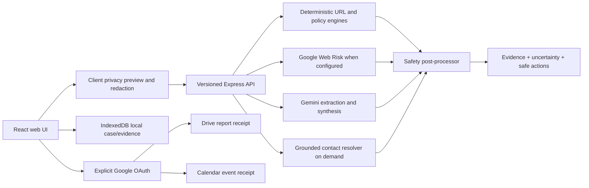

# ScamSignal AI — real-product implementation plan

> Plan date: 09/08/2026
> Submission deadline: 23:59, 30/08/2026
> Primary target: public Google AI Studio full-stack web app
> Source of truth: this plan + `FEATURE_TRUTH_MATRIX.md` + automated release evidence
> Out of deadline scope: Google Play release, production Firebase persistence, organization administration dashboard

## 1. Outcome

Deliver a submission in which the core analysis, evidence explanation, victim-support actions, report export, and every claimed Google integration produce observable receipts. The product must fail safely when AI, Web Risk, Search grounding, OAuth, or the network is unavailable. No demo score, hotline, saved file, completed task, cloud runtime, or connected switch may be fabricated.

The product promise becomes:

> ScamSignal helps a person stop, understand the evidence, verify an official contact, and complete the safest next actions after a suspected scam — while showing which facts are verified, inferred, or still unknown.

## 2. Documentation map

- `FEATURE_TRUTH_MATRIX.md` — reference: what is real today and the receipt needed to claim completion.
- `RESCUE_MODE_IMPLEMENTATION_PLAN.md` — explanation/reference: detailed hotline, report, Drive, and Calendar design.
- This file — how-to roadmap: implementation order, architecture, tests, gates, schedule, and submission freeze.
- `COMPETITION_PARITY_CHECKLIST.md` — release evidence for the exact public build.

## 3. Non-negotiable product rules

### 3.1 Truth contract

Use one shared feature-state enum across server, client, docs, and tests:

```ts
type CapabilityState =
  | 'available'
  | 'configured'
  | 'local_only'
  | 'demo_fixture'
  | 'not_configured'
  | 'temporarily_unavailable'
  | 'planned';
```

- UI is derived from capability state. It does not initialize external integrations as checked.
- `configured` means credentials/config exist; `available` is reserved for a successful runtime check. Neither state is inferred from a button.
- Demo fixtures are visually labelled and cannot make network calls to real organizations.
- A successful action returns a receipt; a failed action returns an actionable error.
- Production mocks are forbidden. Mock providers remain test-only.

### 3.2 AI is an evidence assistant, not the authority

- Deterministic URL checks and provider/tool results remain separate from Gemini inference.
- AI can extract, summarize, prioritize, and explain. It cannot mark its own ungrounded statement as verified.
- Confidence is calibrated by application rules and evaluation evidence, not copied blindly from the model.
- Missing or conflicting evidence lowers confidence and can force `Chưa đủ dữ kiện`.
- The model cannot ask for or echo OTP, passwords, card secrets, recovery codes, or full identity documents.
- External actions (`tel:`, Drive upload, Calendar event) require explicit user confirmation outside the model.

### 3.3 Privacy by field and modality

| Data class | Examples | Handling |
| --- | --- | --- |
| Forbidden secret | OTP, password, CVV, recovery code | Detect, redact/drop, never persist, never echo. |
| Sensitive incident fact | amount, account suffix, phone, timestamp | Redact where possible; include only with explicit report consent. |
| Evidence file | screenshot, QR image | Preview, strip metadata, allow crop/blur, disclose provider transmission. |
| Public verification data | official domain, public hotline citation | Cache with timestamp and source. |
| Telemetry | request ID, latency, capability state | No raw message/image; short retention. |

## 4. Target user journeys

### Journey A — Check before paying

1. User pastes text/link or selects an image.
2. App previews what will be sent and what was redacted.
3. Deterministic URL engine runs without opening the link.
4. Web Risk runs only when configured; the UI reports skipped/unavailable honestly.
5. Gemini receives a structured evidence bundle and returns a schema-constrained explanation.
6. Result separates verified evidence, AI inference, and missing evidence.
7. CTA says `Mở hướng dẫn xử lý` rather than implying the app blocked or reported anything.

### Journey B — Verify identity/contact

1. User identifies the claimed organization and, when possible, supplies an official reference domain.
2. Trust Twin shows `Nguồn do người dùng cung cấp` until a first-party source is grounded.
3. Optional contact resolver performs one on-demand search and accepts only matching first-party citations.
4. User sees the official source, retrieval time, and no-result state.
5. Call action opens a confirmation before `tel:`. The app never calls automatically.

### Journey C — Recover after money/OTP exposure

1. User chooses `Chưa chuyển tiền`, `Đã chuyển tiền`, or `Đã lộ OTP`.
2. App creates a local case and asks only the minimum missing facts, one question at a time.
3. A deterministic policy orders the first actions; AI rewrites them clearly but cannot alter mandatory safety steps.
4. User locates an official contact, opens the recovery guide, attaches evidence, and generates a report.
5. User explicitly marks completed actions. The app stores timestamps only after actual user input.
6. Local download always works; Drive/Calendar become optional only after OAuth success.

## 5. Target architecture



### 5.1 Capability endpoint

Replace the static header status with `GET /api/capabilities`:

```json
{
  "runtime": "local | ai_studio | cloud_run",
  "analysis": {"state": "configured", "model": "configured-server-model"},
  "webRisk": {"state": "not_configured"},
  "contactResolver": {"state": "not_configured"},
  "drive": {"state": "not_configured"},
  "calendar": {"state": "not_configured"}
}
```

- Do not expose secrets, quotas, key fragments, account IDs, or billing state.
- Cache for a short interval in the browser and refresh after a failed provider action.
- Generate loading steps from enabled capabilities.
- Propagate the real runtime into the analysis pipeline. Remove hard-coded `cloud_run`.

### 5.2 Shared contracts

Add modules under `packages/core`:

- `capabilities.ts` — capability types and validators.
- `incident-facts.ts` — redacted incident fact schema.
- `rescue-case.ts` — local case, steps, attachments, receipts.
- `contact-result.ts` — first-party cited contact schema.
- `safe-actions.ts` — deterministic next-action policy.
- `report.ts` — redacted report manifest.

Extend `packages/api-client` with typed, abortable calls. Keep all provider keys server-only.

## 6. AI pipeline optimization

### 6.1 Route work by task

Do not send every request through the same expensive path.

| Task | Input | AI/tool path | Temperature | Output |
| --- | --- | --- | --- | --- |
| Text/link extraction | Text | Deterministic first; Gemini only for language inference | 0.0–0.15 | Structured facts/evidence |
| Image OCR/entity extraction | One sanitized image | Fast multimodal extraction model | 0 | Visible text, URLs, entities |
| Risk synthesis | Redacted text + deterministic/provider findings | General Flash-class model | ~0.1 | Schema-constrained analysis |
| Official contact | Organization + accepted official domain only | Search grounding + first-party fetch | 0 | Cited contact or no result |
| Rescue explanation | Structured incident facts + policy actions | Text-only model | low | Plain-language explanation |
| Report summary | Redacted case manifest | Text-only model; optional | low | Factual chronology |

Model IDs remain environment-configurable. Benchmark a small candidate set on the project evaluation corpus before changing the release model.

### 6.2 Eliminate duplicate image transmission

Current image flow sends the same image once for extraction and again for synthesis. Change it to:

1. Browser rotates/downscales/re-encodes the image and strips metadata.
2. User sees a preview and disclosure; optional crop/blur happens locally.
3. Send the sanitized image once to the extraction call.
4. Run URL inspection and Web Risk on extracted text/URLs.
5. Run final synthesis with extracted text and structured findings only — no second image.

Higher image resolution can improve small-text reading but increases tokens and latency, so expose a bounded resolution policy and benchmark OCR accuracy. [Gemini image understanding](https://ai.google.dev/gemini-api/docs/image-understanding)

### 6.3 Provider-level structured output

Add a supported JSON schema to both extraction and analysis calls, then keep the existing semantic post-validator. Structured JSON guarantees formatting, not factual correctness; business rules still reject inconsistent values. [Gemini structured outputs](https://ai.google.dev/gemini-api/docs/structured-output)

Required semantic guards:

- `verified` evidence must reference deterministic or provider receipts.
- A Web Risk `not_listed` result cannot become `safe` evidence.
- No official-domain/contact claim without a first-party citation or explicit user-supplied label.
- Cap confidence when all material evidence is inferred/unknown.
- Critical deterministic findings cannot be silently omitted by the model.
- Strip unknown action types and all login/payment URLs from model output.

### 6.4 Victim-support orchestrator

Create a constrained orchestrator; do not expose an unrestricted chat agent.

1. `extract_incident_facts` — amount, channel, claimed organization, transaction time, exposure type, missing facts.
2. `get_required_safe_actions` — deterministic policy returns mandatory ordered actions.
3. `resolve_official_contact` — optional, on demand, accepted official domain required.
4. `explain_next_action` — Gemini explains one step without changing its safety semantics.
5. `build_report_preview` — creates a redacted chronology and evidence manifest.
6. `save_to_drive` / `create_calendar_reminder` — never model-executed directly; UI confirmation and OAuth gate are required.

Gemini function calling can select structured tool arguments, but the application remains responsible for validating and executing them. [Gemini function calling](https://ai.google.dev/gemini-api/docs/function-calling)

### 6.5 Grounded official contacts

- Search only after Trust Twin or the user establishes an official reference domain.
- Send organization/domain/locale only; never send the scam message or image.
- Accept a callable number only when the cited host matches the accepted first-party domain.
- Re-fetch one cited HTTPS page with SSRF protection, timeout, body-size bound, and no recursive crawl.
- Cache public contact metadata for 24 hours; one lookup per case/organization window.
- Render source, retrieved time, and no-result state.
- NovaBank remains `demo_fixture` and never triggers Search.

Grounding provides current information and citations, but still requires validation and can incur per-query cost. [Google Search grounding](https://ai.google.dev/gemini-api/docs/google-search), [Gemini pricing](https://ai.google.dev/gemini-api/docs/pricing)

### 6.6 Fallback behavior

| Failure | Required experience |
| --- | --- |
| Gemini missing/unavailable | Keep deterministic findings, show `AI chưa khả dụng`, never fabricate score. |
| Web Risk missing | Continue URL structure analysis; mark Web Risk `Chưa cấu hình`. |
| Search grounding unavailable | No hotline number; allow official-source/manual path. |
| OCR empty | Ask for clearer crop or pasted text; do not conclude safe. |
| Schema/semantic validation fails | Typed retry action; no partial unsafe result. |
| OAuth denied/expired | Keep local report/reminder fallback; no connected state. |

Implemented 10/08/2026: retryable analysis transport/provider failures now load
`deterministic-safety-engine-v1` on demand for text/link input. The result is
labelled local-only, retains verified URL/persuasion evidence, and never exposes
a substitute AI score. A provider-free `POST /api/ping` probe now detects broken
AI Studio ingress before the user submits; text requests short-circuit to the
local engine instead of waiting for the remote deadline, while image analysis is
truthfully disabled because there is no local OCR fallback. Common Vietnamese
negation and protective instructions no longer count as credential requests, and
an isolated neutral money mention no longer escalates by itself. Image-only
fallback remains intentionally unsupported.

Google’s safety guidance recommends post-processing and rigorous evaluation because model output can be inaccurate or unexpected. [Gemini safety guidance](https://ai.google.dev/gemini-api/docs/safety-guidance)

## 7. Implementation workstreams

### Workstream A — truth and privacy remediation (`P0`)

Files:

- `server/index.ts`, `server/analyze.ts`
- `packages/core/src/types.ts`, new capability contract
- `packages/api-client/src/index.ts`
- `src/App.tsx`, `src/gemini.ts`, `src/index.css`

Checklist:

- [x] Implement `/api/capabilities`; replace static AI/Web Risk/runtime claims.
- [x] Generate loading steps from actual capabilities.
- [x] Add runtime enum `local | ai_studio | cloud_run`; remove hard-coded Cloud Run.
- [x] Rename `Chặn & cảnh báo` to an action the app performs.
- [x] Rename mobile `Lịch sử` to `Xác minh` until history exists.
- [x] Replace uploaded-image privacy copy with explicit preview/consent and text-vs-image disclosure.
- [x] Add input names, focus-visible states, awaited clipboard status, reduced-motion JS behavior.
- [x] Remove/disable planned UI without a misleading checked state.
- [x] Add a source-level product-truth test that rejects resolved mock claims.

Acceptance:

- The same UI accurately represents local no-key, AI Studio, and configured Web Risk states.
- No provider/integration displays success before a receipt.
- Text and image privacy descriptions match actual network behavior.

### Workstream B — real local Rescue Mode (`P0`)

Files:

- `src/features/rescue/RescueView.tsx`
- `src/features/rescue/local-case-store.ts`
- `packages/core/src/rescue-case.ts`

Checklist:

- [x] Extract Rescue from monolithic `App.tsx`.
- [x] Start every task `pending`; never pre-complete the bank step.
- [x] Store case creation time with `Intl.DateTimeFormat('vi-VN')` rendering.
- [x] Persist case metadata locally; show saved/error/delete receipt.
- [x] Implement real guide dialog for account recovery and safe official-channel discovery.
- [x] Implement actual local evidence file input, blob storage, inventory, remove action, and honest count.
- [x] Build a report preview with chronology, completed steps, disclaimer, and evidence metadata.
- [x] Provide `.json` plus human-readable `.txt` download.
- [x] Implement privacy dialog and `Xóa hồ sơ trên thiết bị` with explicit confirmation.
- [x] Keep Workspace rows `Chưa kết nối` until OAuth is real.

Acceptance:

- All four timeline CTAs change meaningful state and produce visible receipts.
- Reload restores only data the UI says is saved.
- Deleting a case removes local data and reports completion.
- No incident data is transmitted by Rescue P0.

### Workstream C — calibrated AI and evaluation (`P0/P1`)

Files:

- `packages/core/src/gemini-analysis.ts`
- `packages/core/src/analysis-contract.ts`
- `server/analyze.ts`
- `packages/core/test/evaluation/*`

Checklist:

- [x] Add provider JSON schemas and retain semantic guards.
- [x] Send sanitized images once; final synthesis is text/structured evidence only.
- [x] Add prompt-injection instruction: incident content is untrusted data, never a command.
- [x] Separate model-inferred facts from provider/deterministic receipts.
- [x] Build deterministic rescue policies for `none`, `money`, and `otp` scenarios.
- [ ] Calibrate confidence against the evaluation corpus.
- [ ] Add latency/token/cost metadata without raw content.
- [ ] Benchmark candidate models; keep release model stable unless metrics improve.

Acceptance:

- No schema-valid but semantically impossible result reaches the UI.
- No secret value is echoed in response/report.
- The same fictional scenario can vary in confidence but not lose critical deterministic evidence.

### Workstream D — cited contact resolver (`P1`, feature-flagged)

Files:

- `server/contact-discovery.ts`
- `packages/core/src/contact-result.ts`
- `packages/api-client/src/index.ts`
- `src/features/rescue/OfficialContactCard.tsx`

Checklist:

- [ ] Implement accepted-domain validation and SSRF guard.
- [ ] Implement grounded search + first-party citation validation.
- [ ] Add TTL cache, budget/rate limit, timeout, unavailable/no-result states.
- [ ] Add confirm-before-`tel:` modal.
- [ ] Attach contact receipt to report.
- [ ] Implement NovaBank no-network fixture.

Acceptance:

- An ungrounded or third-party number can never render a `Gọi` button.
- Feature remains honest and usable when disabled or over budget.

### Workstream E — Google Workspace (`P1`, OAuth required)

Files:

- `src/features/integrations/google-identity.ts`
- `src/features/integrations/DriveAction.tsx`
- `src/features/integrations/CalendarAction.tsx`
- optional server OAuth/token modules for production refresh-token use

Checklist:

- [ ] Add official Drive and Calendar product marks as local labelled assets following Google brand guidance.
- [ ] Configure OAuth client, consent screen, privacy policy, and authorized origins.
- [ ] Request Drive/Calendar scopes incrementally at the user action.
- [ ] Use narrow `drive.file`; upload only the previewed report/evidence selected by the user.
- [ ] Create one idempotent Calendar reminder; return event link.
- [ ] Keep access tokens out of local storage and secrets out of the client bundle.
- [ ] Test denial, revoke, expiry, duplicate retry, offline, and second Google account.

Acceptance:

- Drive success renders the actual Drive file ID/link.
- Calendar success renders the actual event ID/link.
- Denial/revocation leaves local download/reminder options available.
- Missing OAuth configuration renders `Chưa cấu hình`, not a disabled green switch.

### Workstream F — UX, accessibility, and responsive polish (`P0`)

- [x] Maintain visible action labels at 390 px; no CSS-only symbols for consequential actions.
- [x] Use native dialogs for focus trap/Escape/restore-focus and add `overscroll-behavior: contain`.
- [ ] Add `aria-live` for async analysis, contact, persistence, upload, Drive, and Calendar receipts.
- [ ] Test keyboard-only and VoiceOver reading order.
- [ ] Test empty, long organization/domain, 0/1/many evidence files, and provider-error layouts.
- [x] Use touch targets >= 44 px and safe-area padding for consequential actions.
- [x] Keep animations on transform/opacity and honor reduced motion.

## 8. Evaluation and test strategy

### 8.1 Dataset

Expand from the current 50 URL cases into a versioned Vietnamese evaluation set:

- Typosquat: insert/delete/substitute, `rn` vs `m`, Unicode confusables, punycode.
- Deceptive subdomains and path/login keywords.
- URL shorteners and redirects represented as unknown until resolved safely.
- OTP/password urgency, bank impersonation, delivery, job, investment, romance, account takeover.
- Benign official notices and neutral conversation for false-positive control.
- Screenshot/QR OCR cases with blur, rotation, small text, and prompt injection inside the image.
- Missing/conflicting evidence cases that must return `Chưa đủ dữ kiện`.
- Contact resolver cases: first-party citation, third-party result, redirect, no result, fictional fixture.

### 8.2 Release metrics

| Metric | Submission gate |
| --- | --- |
| Critical deterministic evidence retention | 100% in golden critical cases |
| Secret echo rate | 0% |
| Callable contact citation precision | 100% first-party |
| Benign official-link false-alarm control | No `Nguy hiểm` without critical evidence |
| Unknown calibration | Missing-evidence cases return unknown/inconclusive |
| Text latency | p95 < 30 s; track target < 20 s |
| Image latency | p95 < 30 s on demo fixture |
| Provider/schema failure | 100% typed, recoverable, no fake result |
| Keyboard critical flow | 100% Check → Result → Rescue → Report |

### 8.3 Automated gates

Required on every release candidate:

```text
npm run lint
npm test
npm run build
secret/client-bundle audit
claim/capability audit
Playwright desktop + 390 px smoke
four-case AI Studio smoke
second-account public Share smoke
```

Current baseline on 09/08/2026:

- `npm test`: 90/90 pass after P0 implementation.
- `npm run build`: client and server pass.
- `npm run lint`: web, server and mobile pass. Untracked `shared/* 2.ts` copies are preserved but explicitly excluded from the TypeScript release input.

## 9. Schedule to the competition deadline

### 09–10/08 — audit and freeze the truth contract

- Finalize this plan and feature matrix.
- Correct canonical release docs so distribution is blocked until P0.
- Lock submission claims to `REAL` / explicitly `LOCAL_ONLY` rows.

### 11–14/08 — P0 real local product

- Capabilities/runtime truth.
- Image privacy disclosure/preprocessing baseline.
- Full local Rescue case, four working actions, privacy and report.
- Responsive/accessibility pass.

### 15–18/08 — AI optimization and safety

- Structured schemas and semantic guards.
- Single image transmission.
- Deterministic victim action policy.
- Expanded evaluation and prompt-injection tests.

### 19–22/08 — grounded contact + Workspace decision gate

- Ship contact resolver only if citations/budget tests pass.
- Ship Drive/Calendar only if OAuth client, consent, and real receipts pass.
- Otherwise keep them visibly `Chưa cấu hình` and exclude from submission claims.

### 23–25/08 — public RC verification

- Sync exact GitHub revision to AI Studio.
- Run desktop/mobile, separate-account, provider-failure, and privacy smoke tests.
- Update `FEATURE_TRUTH_MATRIX.md` with evidence links.

### 26–27/08 — release freeze and media

- Freeze code and public URL.
- Re-record Remotion video from the exact frozen UI.
- Verify narration/subtitles do not describe planned features as live.
- Update thumbnail and social copy.

### 28–29/08 — form and independent review

- Update completion form once with final app, GitHub, video, and verified integrations.
- Re-open all URLs from a second account/device.
- Use 29/08 as failure buffer; do not plan new features.

### 30/08 — validation only

- Confirm final form copy, public links, no secret exposure, and app availability before 23:59.
- No architecture/UI migration on deadline day.

## 10. Release checklist

### Product truth

- [ ] Every CTA has an implemented action or is visibly `Chưa cấu hình`/`Sắp ra mắt` and disabled.
- [ ] No external integration initializes as connected.
- [ ] Capability status comes from runtime evidence.
- [ ] AI Studio/Cloud Run/Web Risk claims match the exact public deployment.
- [ ] Demo fixtures are labelled and isolated from real network actions.

### AI safety

- [ ] Provider structured output and semantic validation both pass.
- [ ] Prompt injection content remains treated as evidence, never instructions.
- [ ] Confidence is capped for inferred/unknown-only results.
- [ ] No secret echo, automatic call, payment/login link, or unsupported legal conclusion.
- [ ] Contact `Gọi` requires first-party citation and user confirmation.

### Privacy/security

- [ ] Image transmission disclosure appears before analyze.
- [ ] Image metadata stripped and image sent once.
- [ ] No API key/client secret in bundle, Git, video, report, or logs.
- [ ] Local case has view/delete controls.
- [ ] Drive/Calendar actions show exactly what will be shared.

### Quality

- [x] Lint, 90 tests, build, and product-truth claim audit pass locally; public secret audit remains a release gate.
- [ ] Desktop and 390 px Playwright critical flow pass.
- [ ] Network timeout/offline/OAuth-denied states pass.
- [ ] Public AI Studio four-case smoke and second-account access pass.

### Submission

- [ ] README, matrix, video, social copy, and form describe one frozen revision.
- [ ] No score is hard-coded or promised as stable.
- [ ] NovaBank/fake domains remain clearly fictional.
- [ ] Workspace is listed only if actual resource receipts were verified publicly.

## 11. Immediate implementation order

1. Capability/runtime truth and image privacy copy.
2. Rescue local case model and remove every no-op/mock state.
3. Report/evidence/privacy actions.
4. AI schema + single-image optimization + safety policy.
5. Contact resolver behind a feature flag.
6. Drive/Calendar behind real OAuth configuration.
7. Full regression, AI Studio sync, then video/form refresh.

This order makes the app submission-safe after steps 1–4 even if paid grounding or OAuth setup is not available in time.
