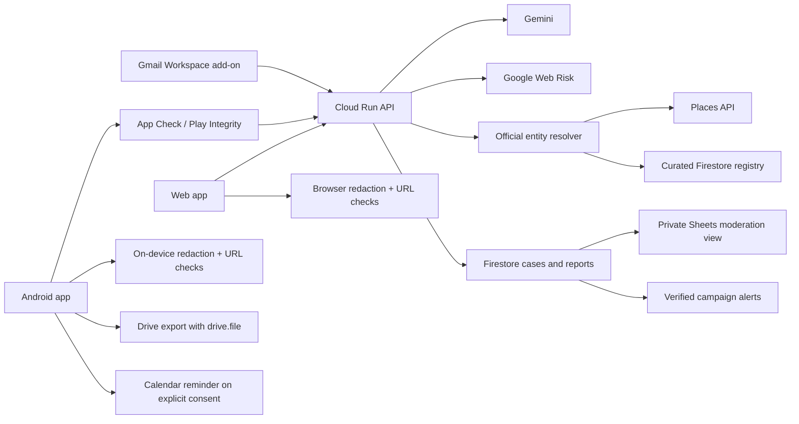

# ScamSignal AI — Google Workspace and Android roadmap

Updated: 09/08/2026

> **Planning status:** this is now a post-competition roadmap. The Android code
> remains in the repository, but new mobile, Workspace and Google Play work is
> parked until the AI Studio web release, demo and completion form are final.

This roadmap separates what already works from visual placeholders, then defines
one shared product architecture for the existing web app, Google Workspace, and
an Android app distributed through Google Play.

## 1. Current implementation audit

| Capability | Status | Evidence in the repository | What remains |
|---|---|---|---|
| Gemini text analysis | Working | `src/gemini.ts`, `shared/gemini-analysis.ts` | Production monitoring, retries, cost limits |
| Screenshot analysis | Working vertical slice | Image input and Gemini extraction | Deterministic QR decoder and on-image annotations |
| Privacy redaction | Working for OTP, password, card-like values | `shared/privacy.ts` and tests | Names, phone/account identifiers, consent preview, retention controls |
| Deterministic URL engine | Working | `shared/url-analysis.ts`, 50-case evaluation set | Official entity registry, more Unicode/redirect cases |
| Google Web Risk | Implemented but not live in AI Studio | `server/web-risk.ts` | Cloud Run deployment, API key and live verification |
| Trust Twin | Working for a user-supplied reference domain | Result UI plus deterministic comparison | Places/Maps and curated official-source resolution |
| Check / Verify / Rescue UI | Working | `src/App.tsx` | Persisted case history and real external actions |
| Evidence export | Working locally as JSON download | `downloadReport()` and `exportCase()` | Drive/Docs export, PDF, signed timestamps |
| Helpful / unclear feedback | Session-only demo | `sessionStorage` in `LearningLoop` | Firestore, consent, moderation analytics |
| Google Drive switch | Visual placeholder | Copy says “Kết nối Google Drive khi triển khai” | OAuth and Drive upload |
| Google Calendar switch | Visual placeholder | Copy says “Đồng bộ Google Calendar khi triển khai” | OAuth and event creation |
| Firebase Auth / Firestore / App Check | Not implemented | No Firebase dependencies or configuration | Project, rules, SDKs, token verification |
| Google Places / Maps | Not implemented | Product vision only | Entity-resolution endpoint and attribution |
| Gmail Workspace add-on | Not implemented | Product vision only | Manifest, contextual card UI, HTTP endpoint, review |
| Google Sheets moderation | Not implemented | Product vision only | Reviewer sheet and server-side append |
| FCM campaign alerts | Not implemented | Product vision only | Opt-in topics, moderation trigger, notification UX |
| Campaign clustering / BigQuery | Not implemented | Product vision only | Redacted dataset, jobs, embeddings and evaluation |
| Android mobile app | Working offline vertical slice; parked | `apps/mobile`, Share Intake, Photo Picker, local QR/URL checks and tests | Real-device E2E, cloud client, production UX and Play pipeline after the competition |

The current app is a strong competition vertical slice, not the complete product
described in `PRODUCT_VISION.md`.

## 2. Product and technology decision

### Recommended mobile stack

Use **React Native with Expo prebuild/development builds**, not a thin WebView.

Reasons:

- The deterministic URL engine, privacy redaction, API contracts, schemas, and
  tests are already TypeScript and can be shared without rewriting them.
- React Native gives a genuine Android UI, accessibility semantics, offline
  storage, system sharing, photo picker, notifications, and secure storage.
- Expo/EAS can produce the Android App Bundle required by Google Play and can
  submit builds to internal or production tracks.
- Prebuild keeps the native `android/` project available for the small custom
  bridge required to receive `ACTION_SEND` text and image intents.

Do not use Expo Go for this product. Use a development build from the first
sprint because inbound share intents, App Check/Play Integrity, and production
Google authentication all touch native Android configuration.

### Proposed repository layout

```text
scamsignal/
  apps/
    web/                  existing Vite UI
    mobile/               Expo React Native Android app
    workspace-addon/      Gmail/Workspace card endpoints and manifest
  services/
    api/                  Express API deployed to Cloud Run
  packages/
    core/                 types, URL engine, privacy redaction, finalization
    api-client/           typed API requests, retries, error contracts
    evidence/             report model and export serializers
    config/               shared validation and public configuration
  firebase/
    firestore.rules
    firestore.indexes.json
    storage.rules
  evaluation/
```

The web and mobile interfaces should remain separate. Share product logic and
contracts, not DOM components or CSS.

## 3. Target architecture



### Request flow

1. The Android Sharesheet sends `text/plain` or a selected image to ScamSignal.
2. The app previews the content and requires confirmation before analysis.
3. OTP/password/card-like values are redacted on-device.
4. The local URL engine returns an immediate preliminary explanation, including
   an offline or network-unavailable state.
5. The app sends only the redacted evidence to `/v1/analyses` with a Firebase
   App Check token and an idempotency key.
6. Cloud Run performs Web Risk, official-entity resolution, and Gemini analysis.
7. The result keeps deterministic evidence, provider evidence, AI inference,
   and unknowns separate.
8. Nothing is persisted unless the user explicitly chooses Save or Report.

## 4. Google integration design

### Firebase foundation — implement first

Use Firebase as the identity, attestation, operational-data, and notification
layer, not as a replacement for the evidence API.

- Anonymous Auth is created only when a user saves a case, submits feedback, or
  opts into alerts. Core analysis remains usable without an account.
- Firestore Security Rules scope private cases to `request.auth.uid`.
- App Check uses Play Integrity on Android and reCAPTCHA Enterprise on web.
- Cloud Run verifies `X-Firebase-AppCheck` before accepting mobile reports,
  exports, or high-cost analysis requests.
- Enable enforcement after observing valid/invalid traffic in metrics; do not
  enable it blindly during the first development build.

Proposed collections:

```text
users/{uid}
cases/{caseId}
cases/{caseId}/artifacts/{artifactId}
feedback/{feedbackId}
reports/{reportId}
campaigns/{campaignId}
officialEntities/{entityId}
moderationQueue/{queueId}
```

`cases` store redacted structured facts by default. Raw images are opt-in,
encrypted in Cloud Storage, and deleted automatically after 24 hours unless the
user explicitly retains them for an evidence package. Public campaign data is
published only after human review and corroboration.

### Google Drive / Docs — Rescue evidence package

- Ask for authorization only after the user taps **Save to Google Drive**.
- Use the narrow `drive.file` scope, never broad `drive` or `drive.readonly`.
- Generate a redacted PDF or Google Doc plus a machine-readable JSON attachment.
- Include: case ID, timestamps, user-entered facts, verified sources, AI-labeled
  inferences, hashes of retained artifacts, and completed recovery steps.
- Return the created file ID and `webViewLink`; store only that ID in the case.
- Use an idempotency key so retries cannot create duplicate evidence files.

### Google Calendar — recovery reminders

- Keep Calendar optional and action-triggered.
- First release: offer a local Android reminder or an `.ics` export without
  requesting Google account access.
- Workspace release: request Calendar authorization only after **Add reminder**,
  then create a 24-hour follow-up event with a deterministic event ID.
- Never include OTPs, account numbers, full message bodies, or allegations in
  the event title/description.
- Store the Calendar event ID so retry/update/delete operations are idempotent.

### Gmail Workspace add-on — highest-value Workspace feature

Use a Google Workspace add-on with an HTTP runtime pointing to Cloud Run.

- A Gmail contextual trigger activates only when the user opens the add-on for a
  message.
- Request `gmail.addons.current.message.readonly`, not mailbox-wide
  `gmail.readonly`.
- The card shows: redaction preview, **Check with ScamSignal**, one-line status,
  primary safe action, Trust Twin mismatch, and **Open full report**.
- Message content is redacted before persistence; the add-on never modifies,
  labels, sends, or deletes email in the MVP.
- Use the same `/v1/analyses` contract as web/mobile and a separate
  `/workspace/gmail/context` adapter for Google event objects.
- Start as an unpublished test add-on, then prepare OAuth and Workspace
  Marketplace review only after the scopes and privacy policy are stable.

### Google Places / Maps — independent channel resolution

- Combine a human-curated `officialEntities` registry with Places API (New).
- Request only required fields such as `displayName`, `nationalPhoneNumber`,
  `websiteUri`, `googleMapsUri`, `businessStatus`, and address.
- Treat Places as one independent source, not proof that a message is genuine.
- For banks and government agencies, prefer a curated national/official registry;
  Places primarily resolves branches and nearby assistance.
- Preserve Google attribution and comply with field/caching requirements.

### Google Sheets — moderation operations only

- The mobile/web clients never receive a spreadsheet ID or service credential.
- A backend worker appends redacted report summaries to a private review sheet.
- Columns: report ID, received time, normalized indicators, evidence count,
  cluster ID, moderation state, reviewer decision, and decision timestamp.
- Raw message/image data stays out of Sheets.
- Firestore remains the source of truth; Sheets is an operational view that can
  be replaced later without changing the app contract.

### Firebase Cloud Messaging

- Users opt into narrow categories such as banking, delivery, employment, or a
  province/region; do not subscribe everyone to all alerts.
- Only a moderated campaign transition to `verified` can enqueue an alert.
- Notification text must describe a pattern, not publicly accuse an unverified
  phone number, person, or account.

## 5. Android product scope

### Mobile MVP screens

1. **Home** — Check, Verify, Emergency.
2. **Share intake** — shared text/image preview with edit and privacy redaction.
3. **Capture** — paste, system photo picker, camera, or QR scan.
4. **Result** — decision banner, exact clue, Trust Twin, evidence groups.
5. **Rescue** — first 15 minutes, local checklist, official contact route.
6. **Evidence package** — export locally or optionally to Drive.
7. **History** — local/private cases; cloud sync only after consent.
8. **Alerts** — opted-in verified campaigns.
9. **Privacy & data controls** — retention, delete case, sign out/delete account.

### Native Android capabilities

- Receive `ACTION_SEND` for `text/plain` and `image/*`; do not register `*/*`.
- Validate MIME type and size, process image data off the UI thread, and let the
  user confirm/edit content before analysis.
- Use Android Photo Picker for occasional screenshots; request no broad
  `READ_MEDIA_IMAGES`, `READ_MEDIA_VIDEO`, SMS, call-log, contacts, accessibility,
  or all-files permission.
- Use encrypted secure storage for tokens. Do not put Gemini, Web Risk, Places,
  service-account, or Workspace client secrets in the application bundle.
- Gracefully support offline deterministic URL checks and queue only explicit
  saves/reports for retry.

## 6. Google Play release constraints for this project

- Target Android 16 / API level 36 now. Google Play requires API 36 for new apps
  and updates submitted from 31/08/2026.
- Produce an Android App Bundle (`.aab`) and use Play App Signing.
- Complete the Data safety form for closed/open/production tracks and publish a
  privacy-policy URL even if a release stores no user content.
- Accurately disclose content sent to Cloud Run, Gemini, Firebase, Crashlytics,
  Places, or other SDKs. “No data collected” is not accurate once cloud analysis
  or saved reports are enabled.
- If the app supports account creation, provide both an in-app deletion path and
  a public web deletion-request URL.
- A personal Play developer account created after 13/11/2023 needs a closed test
  with at least 12 continuously opted-in testers for 14 days before applying for
  production access.
- Prepare app icon, feature graphic, phone screenshots, short/full description,
  support email, content rating, ads declaration, app access instructions, and
  reviewer-safe demo data.

## 7. Delivery roadmap

### Milestone 0 — contracts and monorepo (2–3 days)

- Move shared logic to `packages/core` without behavior changes.
- Version the backend contract as `/v1/analyses`.
- Add contract tests that run against web and mobile clients.
- Scaffold `apps/mobile` with Expo prebuild and API level 36.
- Configure development, staging, and production environments.

Acceptance:

- Existing 56 tests pass from the new workspace.
- Web UI and AI Studio package still build.
- Android development build opens on a physical device.

### Milestone 1 — Android offline-first MVP (parked; 7–10 days total)

- Build Home, Share intake, Capture, Result, Trust Twin, and Rescue.
- Implement `ACTION_SEND` text/image receiver and system Photo Picker.
- Reuse local redaction and URL inspection before network access.
- Add secure token storage, network/offline states, accessibility, and crash-safe
  state restoration.

Acceptance:

- Share a suspicious URL from Chrome or Gmail into ScamSignal in two taps.
- Shared content is editable and requires confirmation.
- A typosquat explanation works offline; cloud AI enriches it when online.
- No broad photo, SMS, call-log, accessibility, or storage permission exists.

### Milestone 2 — Firebase and protected API (5–7 days)

- Configure anonymous Auth, Firestore, App Check, Play Integrity, rules, indexes,
  Emulator Suite tests, and Cloud Run token verification.
- Connect helpful/unclear feedback and consent-based redacted reports.
- Add TTL and deletion jobs for raw artifacts.

Acceptance:

- Valid Play build reaches protected endpoints; invalid App Check tokens fail.
- A user can read/delete only their own cases.
- No raw evidence is stored without explicit consent.

### Milestone 3 — Drive and Calendar actions (4–6 days)

- Implement local PDF/JSON report generation.
- Add incremental Drive `drive.file` authorization and upload.
- Add local reminder first, then optional Google Calendar event creation.
- Add idempotency and revocation/error UX.

Acceptance:

- One tap after consent creates exactly one redacted Drive file.
- Calendar retry cannot duplicate the follow-up event.
- Denying OAuth leaves local export/reminder fully usable.

### Milestone 4 — Gmail add-on and operations (7–10 days)

- Build HTTP Workspace add-on manifest, contextual card, and Cloud Run adapter.
- Add curated official entities plus Places details to Trust Twin.
- Add Firestore-to-Sheets redacted moderation export.

Acceptance:

- An opened Gmail message can be checked without copy/paste.
- The add-on has no whole-mailbox scope and never changes the message.
- Reviewers see only redacted structured data in Sheets.

### Milestone 5 — Play release (post-competition; minimum 14–21 days)

- Build signed AAB, create Play listing, complete privacy/Data safety/app-content
  declarations, and upload to internal testing.
- Run device tests, Firebase Test Lab, performance/accessibility checks, and a
  closed beta with an explicit scenario checklist.
- If the account is subject to the rule, keep 12 testers opted in continuously
  for 14 days, then apply for production access.

Acceptance:

- Zero blocker crashes/ANRs in the release candidate.
- Privacy policy and Data safety answers match actual SDK/network behavior.
- Four end-to-end scenarios pass: benign, typosquat, screenshot/QR, and uncertain.
- Store screenshots and demo show the same production build.

## 8. Priority and cost tracks

### Track A — competition / minimum billing

1. Freeze one canonical AI Studio web project and close local ↔ AI Studio parity gaps.
2. Publish one public web URL through AI Studio Publish/Cloud Run.
3. Verify public access and four demo cases on the exact release candidate.
4. Synchronize YouTube, one social post and the completion form.
5. Keep Android, Gmail, Drive, Calendar, Places and Sheets out of the critical
   path; do not claim any integration that is not live and verified.

### Track B — production / billing enabled

1. Deploy the shared Cloud Run API and secrets.
2. Enable Web Risk and Places with quotas and budget alerts.
3. Add Firebase/App Check and persistence.
4. Add Workspace OAuth, Drive/Calendar, Gmail add-on, and moderation workflow.
5. Add cost, abuse, latency, calibration, and deletion monitoring.

## 9. Implementation progress — 09/08/2026

### Competition scope decision

- Web AI Studio is the only competition release candidate.
- Mobile is a retained working prototype and future companion, not a separate
  submission and not a released Google Play application.
- Mobile does not block public web deployment, demo recording or form updates.
- Resume the remaining mobile gates after the final competition form update or
  after 23:59 30/08/2026.

Completed in code and automated/browser verification:

1. Shared core/API packages without changing the working web build.
2. Expo SDK 57/API-36 mobile scaffold and reproducible Android prebuild.
3. Android `ACTION_SEND` text/image filters plus Share Intake
   preview/edit/confirm, with raw content kept out of routes and logs.
4. System Photo Picker with type/size checks and no broad storage permission.
5. Local URL/redaction result and deterministic QR-from-image flow that never
   auto-opens decoded content.
6. 72-test suite, web/server/mobile builds, Expo Doctor 20/20 and 390×844 visual
   smoke flows with zero console errors/warnings.

Still required when Milestone 1 resumes:

1. Install a development/preview APK on a real Android device and run Chrome,
   Gmail and Gallery Share Sheet cases.
2. Verify content URI lifetime across different providers and implement a
   managed temporary copy only where provider lifetime requires it.
3. Measure offline URL/QR latency and memory on low/mid-range hardware.
4. Connect the typed environment-based API client only after explicit cloud
   consent; keep all provider secrets server-side.

For the competition, follow `UPGRADE_PLAN.md` and `MASTER_IMPLEMENTATION_PLAN.md`.
For production after the competition, close the real-device gate before Google
Play and close protected API/OAuth gates before public Workspace integrations.

## Official references

- Workspace add-ons: https://developers.google.com/workspace/add-ons/how-tos/building-workspace-addons
- Workspace contextual triggers: https://developers.google.com/workspace/add-ons/concepts/workspace-triggers
- Gmail message UI: https://developers.google.com/workspace/add-ons/gmail/extending-message-ui
- Drive scopes: https://developers.google.com/workspace/drive/api/guides/api-specific-auth
- Drive uploads: https://developers.google.com/workspace/drive/api/guides/manage-uploads
- Calendar events: https://developers.google.com/workspace/calendar/api/guides/create-events
- Sheets values: https://developers.google.com/workspace/sheets/api/guides/values
- Places resource fields: https://developers.google.com/maps/documentation/places/web-service/reference/rest/v1/places
- Firebase App Check: https://firebase.google.com/docs/app-check
- App Check custom backend verification: https://firebase.google.com/docs/app-check/custom-resource-backend
- Firestore Security Rules: https://firebase.google.com/docs/firestore/security/get-started
- Android receive sharing: https://developer.android.com/training/sharing/receive
- Android Photo Picker: https://developer.android.com/training/data-storage/shared/photo-picker
- Play target API requirements: https://developer.android.com/google/play/requirements/target-sdk
- Play testing requirement: https://support.google.com/googleplay/android-developer/answer/14151465
- Play Data safety: https://support.google.com/googleplay/android-developer/answer/10787469
- Play account deletion: https://support.google.com/googleplay/android-developer/answer/13327111
- Expo Android submission: https://docs.expo.dev/submit/android/
